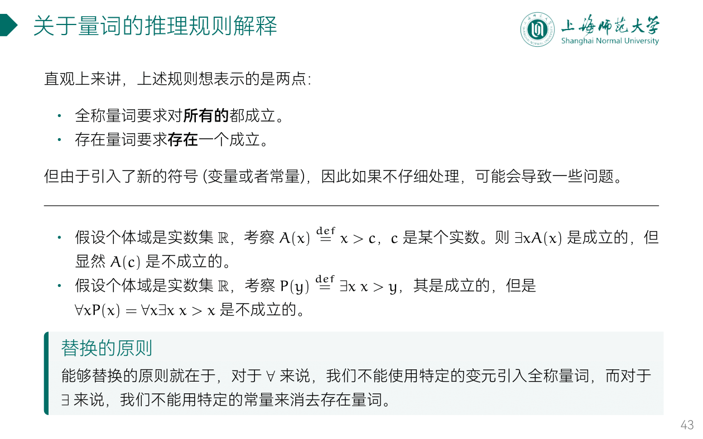
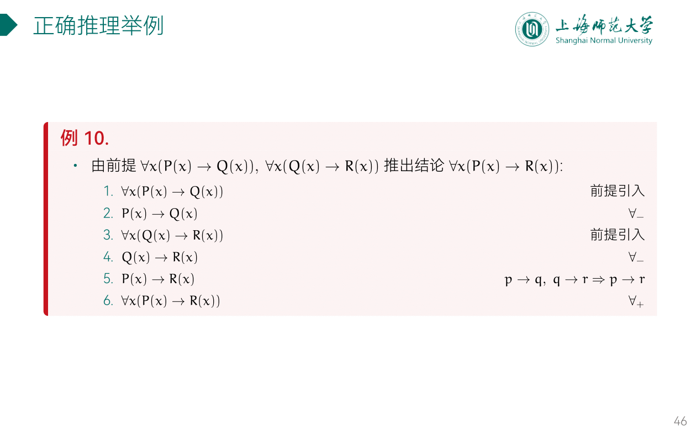
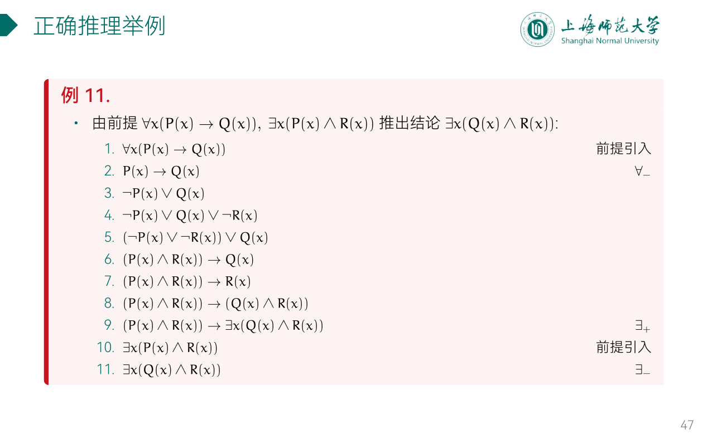

---
aliases:
  - 量词的推理规则
---

- 全称量词消去规则
- 全称量词引入规则

- 存在量词消去规则
- 存在量词引入规则

## ex

### ex1

### ex2

### ex3

证明：
- 航海家都教育自己的孩子成为航海家，
- 有一个人教育他的孩子去做飞行员，
- 这个人一定不是航海家。（个体域为人类集合。）

- $S(x)$: $x$ 是航海家
- $E(x)$: $x$ 教育他的孩子成为航海家
- 前提：$\forall{x}(S(x)\to E(x))$, $\exists{x}(\neg E(x))$
- 结论：$\exists(x)(\neg E(x)\wedge\neg S(x))$

---

证明：
- 每个旅客或者坐头等舱或者坐经济舱；
- 每个旅客当且仅当他富裕时坐头等舱；
- 有些旅客富裕但并非所有的旅客都富裕。
- 因此有些旅客坐经济舱。（个体域取全体旅客组成的集合）

- $F(x)$: $x$ 坐头等舱
- $G(x)$: $x$ 坐经济舱
- $H(x)$: $x$ 富裕
- 前提：$\forall{x}(F(x)\vee G(x))$, $\forall{x}(H(x)\iff F(x))$, $\exists{x}(H(x))$, $\exists{x}(\neg H(x))$
- 结论：$\exists{x}(G(x))$

---

