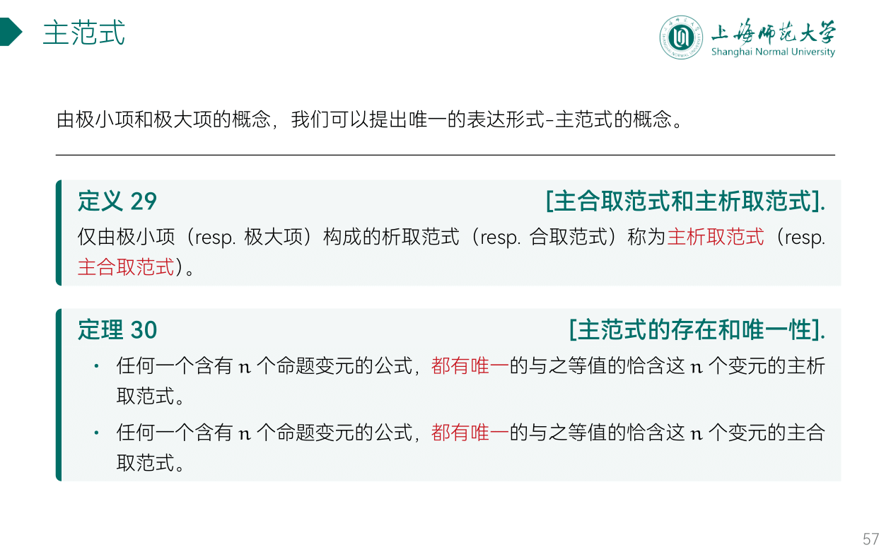
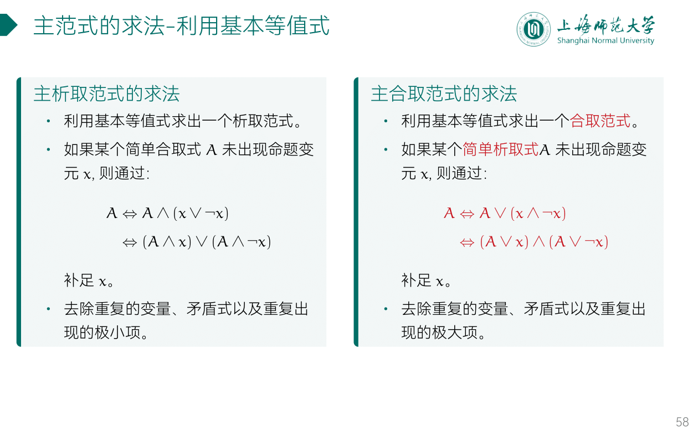
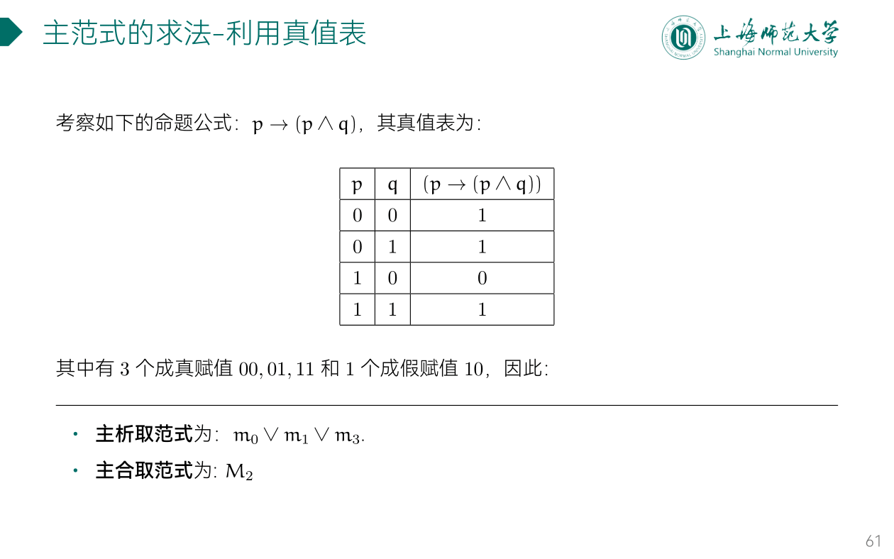

---
aliases:
  - 主范式
---

## 主范式

- 主析取范式 (极小项) $m_0\vee{m_1}\vee{m_2}\vee{m_3}$
- 主合取范式 (极大项) $M_1\wedge{M_2}\wedge{M_3}\wedge{M_4}$

## 主范式的求法

### 1/2 利用[基本等值式](基本等值公式.md)

- 互补对析取为1
- 合取项出现1等同没出现

- 互补对合取为0
- 析取项出现0等同没出现

### 2/2 主范式的求法：利用真值表

