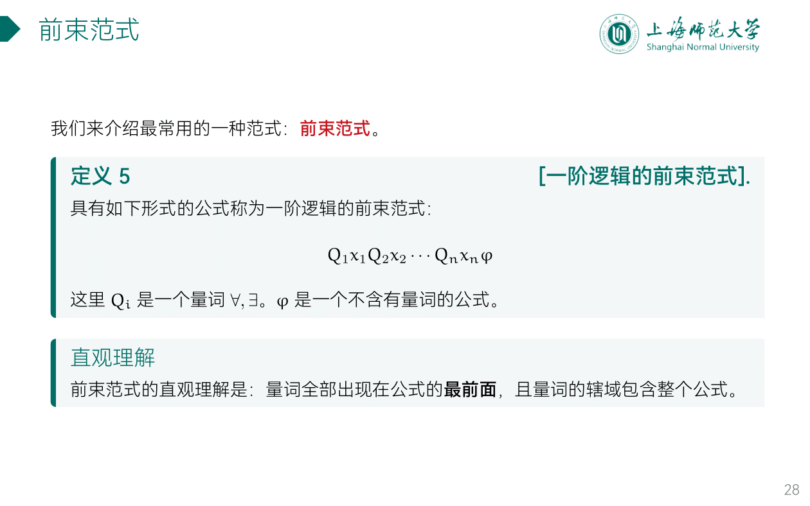
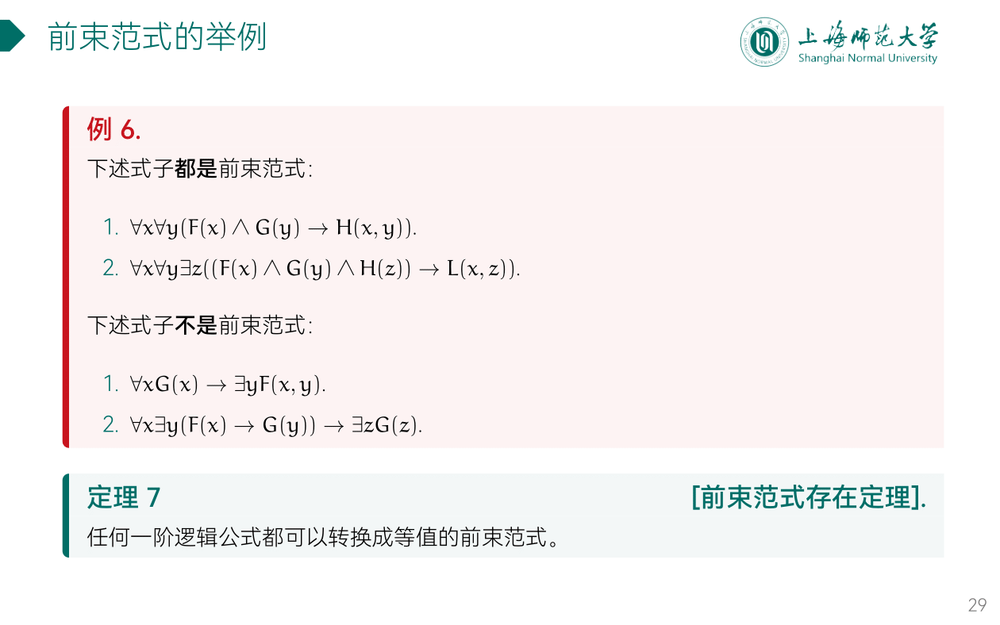
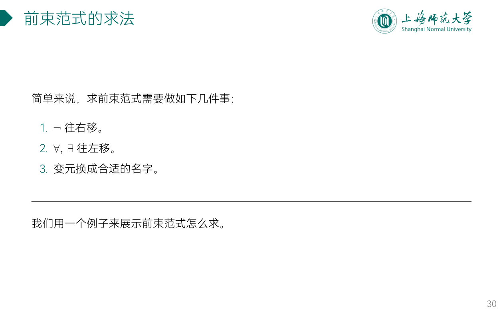
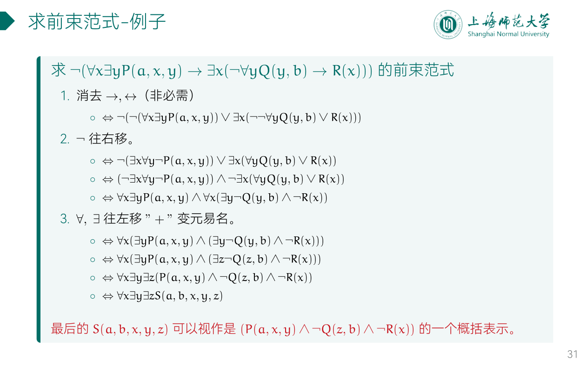

---
aliases:
  - 前束范式
---

## 前束范式的求法

## ex

用谓词和量词将下列命题符号化，并化为前束范式。

1. 尽管有些人聪明，但未必一切人都聪明。
2. 所有人都学习和工作。

---

- 当论域为全体人类时：
	- $\exists{x}(\neg{P(x)})$, 其中 $P(x)$ 表示 $x$ 聪明
	- $\forall{x}(P(x)\wedge{Q(X)})$, 其中 $P(x)$ 表示 $x$ 学习，$Q(x)$ 表示 $x$ 工作
- 当论域为全总个体域时：
	- $\exists{x}(M(x)\wedge{P(x)})\wedge\exists{x}(M(x)\wedge\neg{P(x)})$, 其中 $P(x)$ 表示 $x$ 聪明, $M(x)$ 表示 $x$ 是人。
	- $\forall{x}(M(x)\to(P(x)\wedge{Q(X)})$, 其中 $P(x)$ 表示 $x$ 学习，$Q(x)$ 表示 $x$ 工作, $M(x)$ 表示 $x$ 是人。

---
