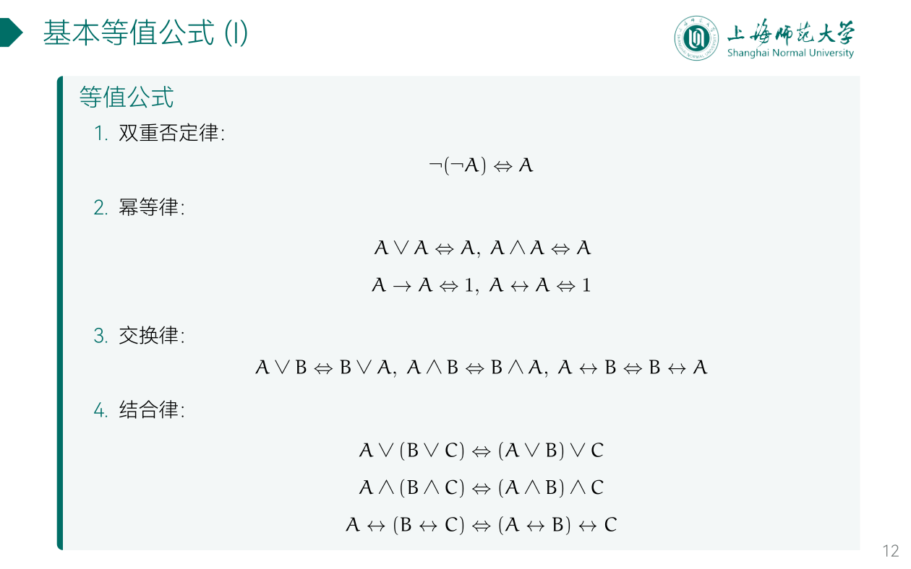
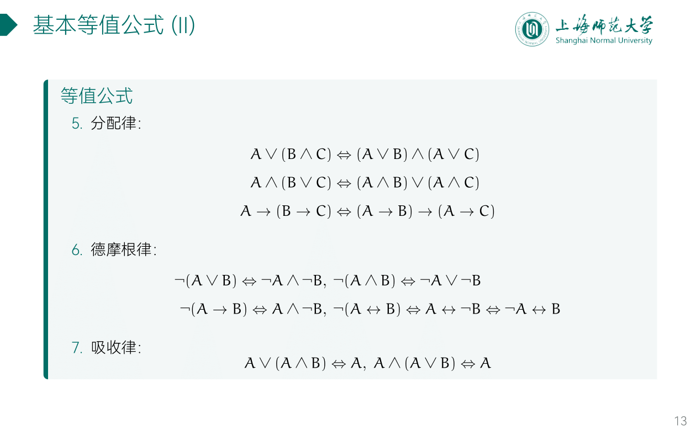
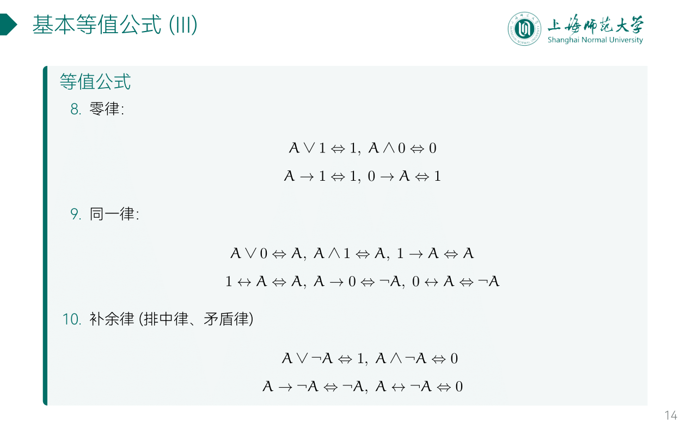
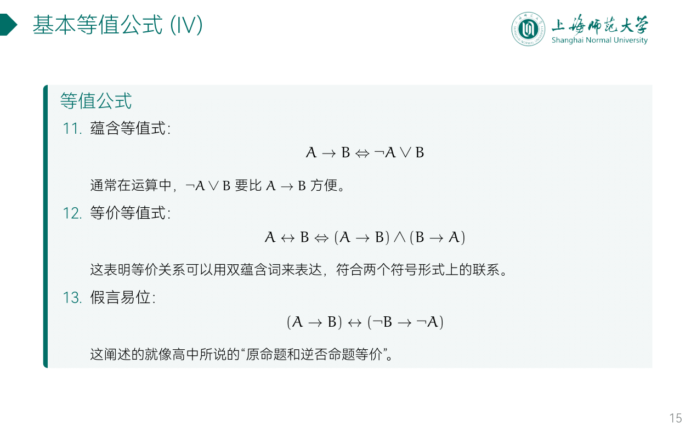
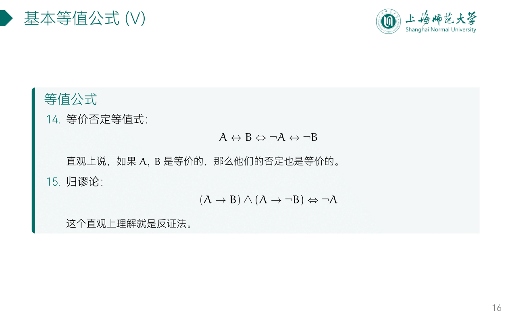

---
aliases:
  - 基本等值公式
  - 基本等值式
---

- 幂等律
	- 口：自己和自己析取，等价于自己
	- 口：自己和自己合取，等价于自己
	- 口：自己蕴涵自己，等价于1
	- 口：自己等值自己，等价于1
- 交换律：$\vee$, $\wedge$, $\Leftrightarrow$
	- 不可交换：$\to$

- **分配律**: 括号中间的联结词作为分配后的主联结词
	- $A\times(B+{C})=(A\times{B})+(A\times{C})$
	- $A\vee(B\wedge{C})=(A\vee{B})\wedge(A\vee{C})$
	- $A\wedge({B\vee{C}})=(A\wedge{B})\vee(A\wedge{C})$
- **德摩根律**

- **零律**
	- 口：析取项出现1，结果就是1
	- 口：合取项出现0，结果就是0
- **同一律**
	- 口：析取项出现0，拜拜0
		- 0 or 0 = 0
		- 0 or 1 = 1
	- 口：合取项出现1，拜拜1
		- 1 and 0 = 0
		- 1 and 1 = 1
- **补余律（排中律，矛盾律）**
	- 口：互补对析取为1，互补对合取为0
		- 1 or 0 = 1
		- 1 and 0 = 0
	- 口：互补对的蕴涵为后件，互补对的等值为0
		- 1 to 0 = 0
		- 0 to 1 = 1
		- 1 iff 0 = 0
		- 0 iff 1 = 0

11. **蕴含等值式**

---

- $p\vee{q}$
	- $\neg p\to q$
	- $\neg q\to p$

