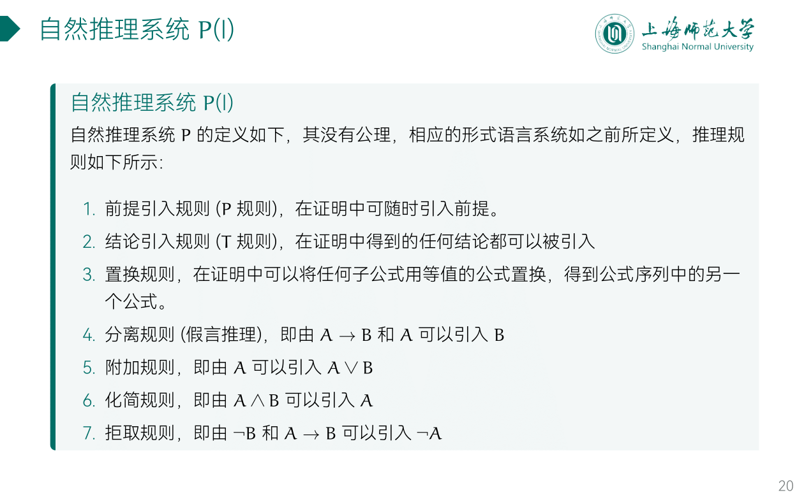
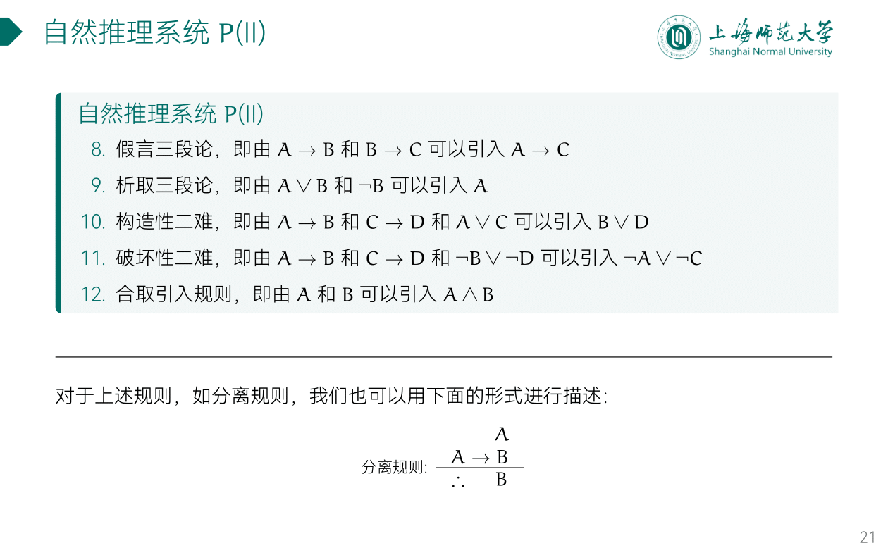
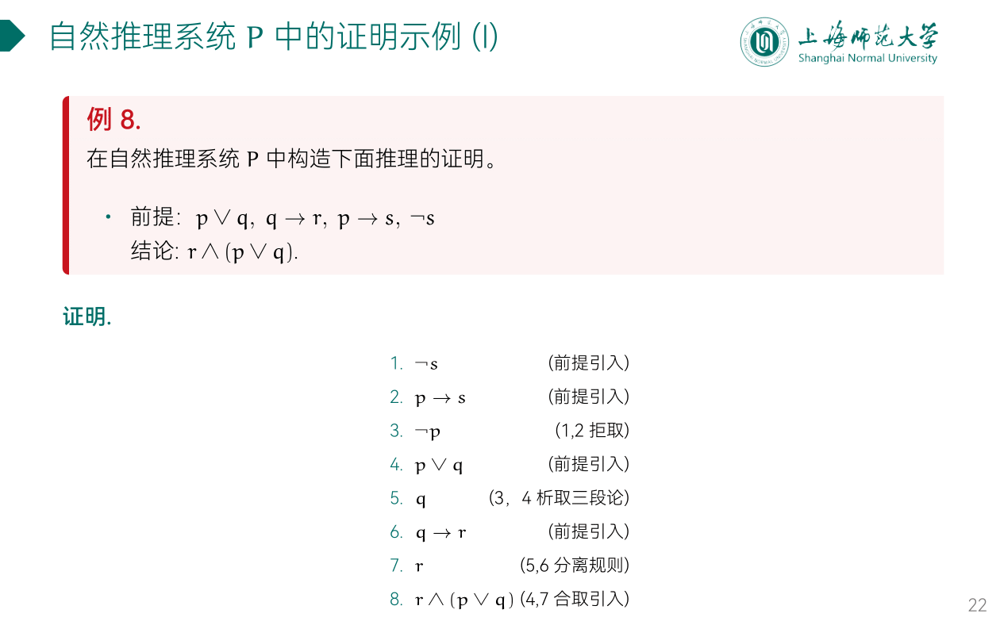
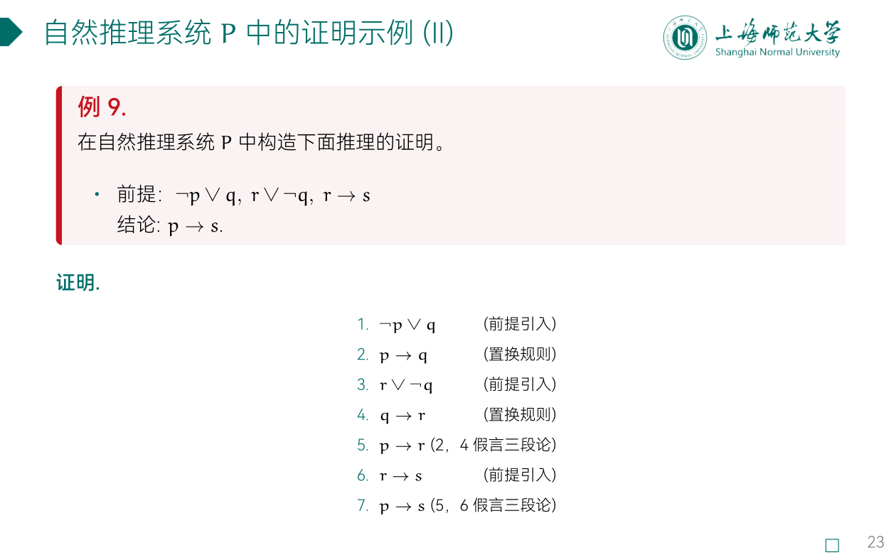
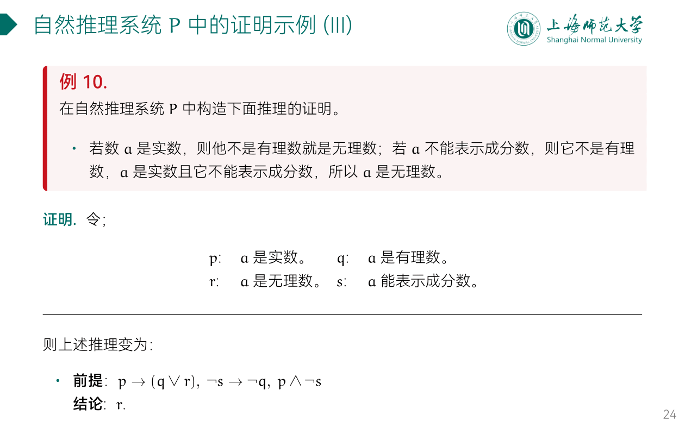
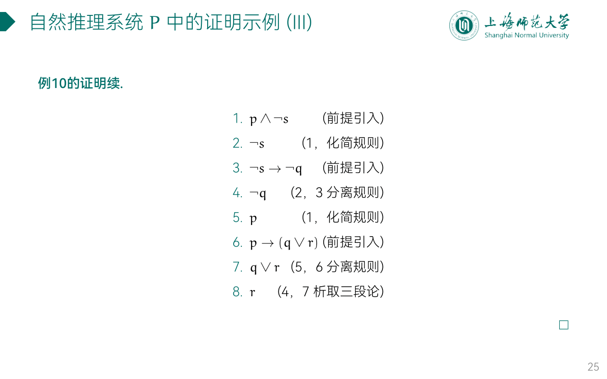

---
aliases:
  - 自然推理系统
---

## 自然推理系统 P(I)

- 前提引入规则（P 规则）：在证明中可随时引入前提。
- 置换规则，在证明中可以将任何子公式用等值的公式置换，得到公式序列中的另一个公式。
- 分离规则（假言推理）：即由 $A\to{B}$ 和 $A$ 可以引入 $B$
	- 口：前对后也对，把后分离出来
- 化简规则：即由 $A\wedge{B}$ 可以引入 $A$ 和 $B$
- 拒取规则：即由 $\neg{B}$ 和 $A\to{B}$ 可以引入 $\neg{A}$
	- 口：后错前也错，前面拒取

- 假言三段论，即由 $A\to{B}$ 和 $B\to{C}$ 可以引入 $A\to{C}$
- 析取三段论：即由 $A\vee{B}$ 和 $\neg{B}$ 可以引入 $A$
	- 口：有假必有真
- 合取引入规则：即由 $A$ 和 $B$ 可以引入 $A\wedge{B}$

## ex

- 在自然推理系统 P 中构造推理的证明

### ex1

### ex2

### ex3

### ex4

在自然推理系统 P 中构造下面推理的证明：

- 如果今天是星期三，那么我有一次离散数学或数字逻辑测验；如果离散数学课老师有事，那么没有离散数学测验；今天是星期三且离散数学老师有事。 所以，我有一次数字逻辑测验。

**证明.** 令：

- $p$: 今天是星期三
- $q$: 我有一次离散数学测验
- $r$: 我有一次数字逻辑测验
- $s$: 离散数学课老师有事

则上述推理变为：

- **前提**：$p\to({q}\vee{r})$, $s\to{\neg{q}}$, $p$, $s$ 
- **结论**：$r$

### ex5

在自然推理系统 P 中构造下面推理的证明：

- 若明天是星期一或星期三，我就有课；
- 若有课，今天我预习；
- 我今天下午没有预习；
- 所以，明天不是星期一和星期三。

**证明.** 令：

- $p$: 明天是星期一
- $q$: 明天是星期三
- $r$: 我有课
- $s$: 我预习

则上述推理变为：

- **前提**：$(p\vee{q})\to{r}$, $r\to{s}$, $\neg{s}$
- **结论**：$\neg{p}\wedge\neg{q}$

