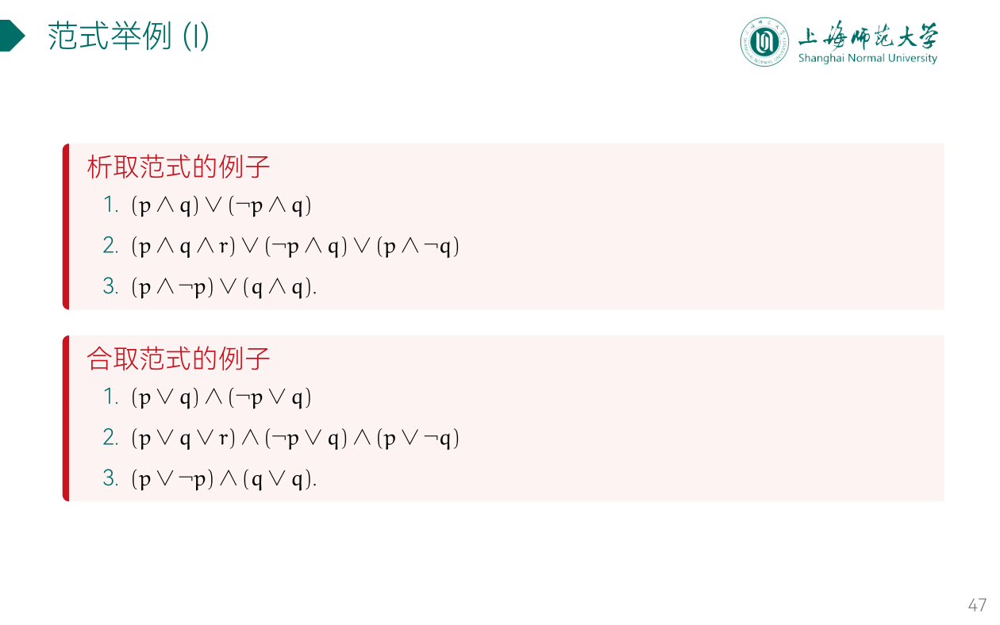
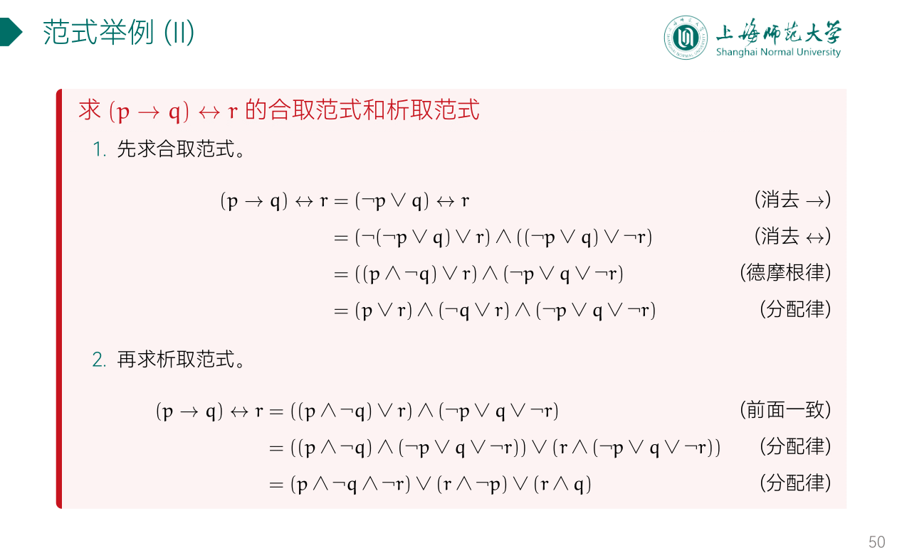
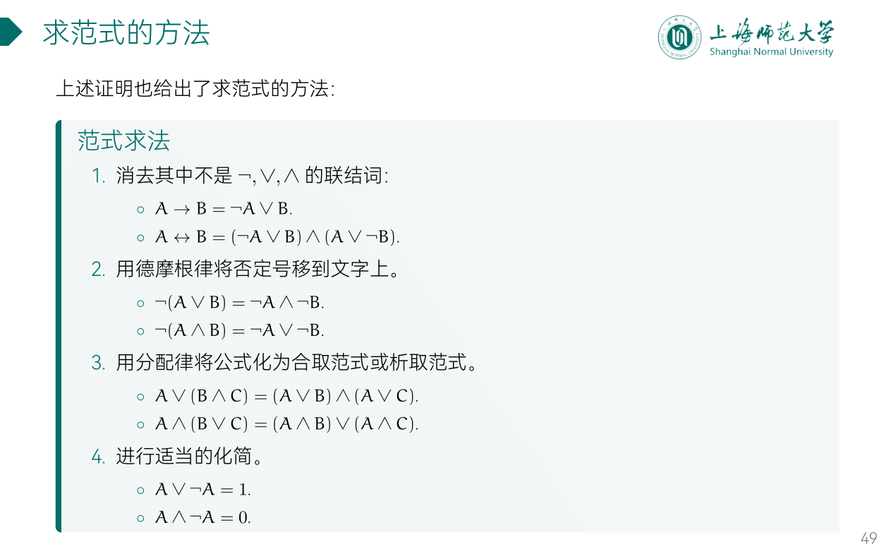

---
aliases:
  - 范式
---

## 范式

- 要什么，就把什么当 +

## 求范式

Q: 为何要“范式”？
A: 对于给定**公式**的**判定**问题，可用**真值表**方法加以解释，但当**公式**中**命题变元**的数目较大时， 计算量较大，每增加一个**命题变元**，**真值表**的行数要翻倍，计算量加倍；此外，对于同一问题，可以从不同的角度去考虑，产生不同的但又等价的**命题公式**，即同一个**命题**可以有不同的表达形式。这样给**命题演算**带来了一定的困难，因此有必要使**命题公式规范化**。

