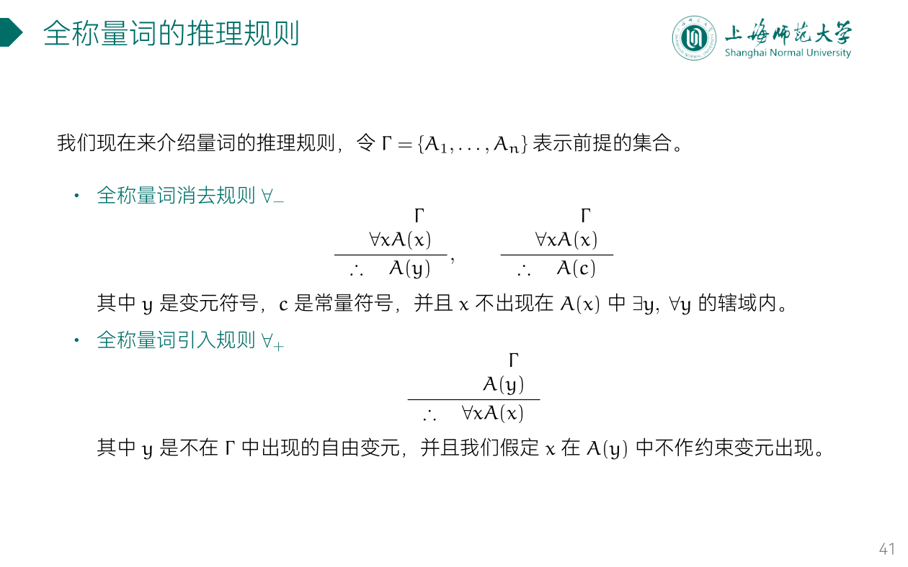
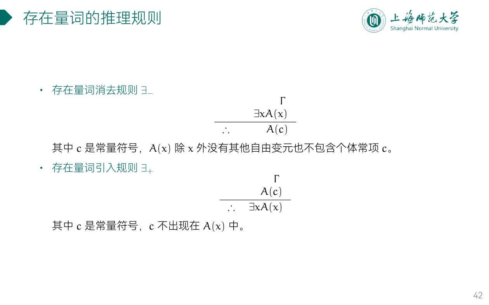
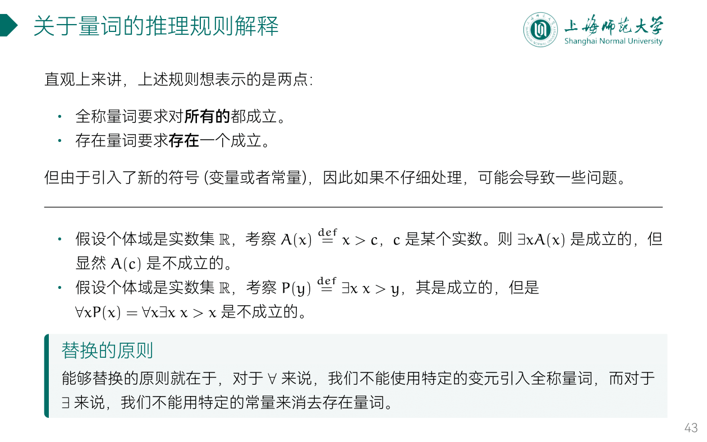

---
aliases:
  - 量词的推理规则
---

## ex

证明：
- 航海家都教育自己的孩子成为航海家，
- 有一个人教育他的孩子去做飞行员，
- 这个人一定不是航海家。（个体域为人类集合。）

证明：
- 每个旅客或者坐头等舱或者坐经济舱；
- 每个旅客当且仅当他富裕时坐头等舱；
- 有些旅客富裕但并非所有的旅客都富裕。
- 因此有些旅客坐经济舱。（个体域取全体旅客组成的集合）

